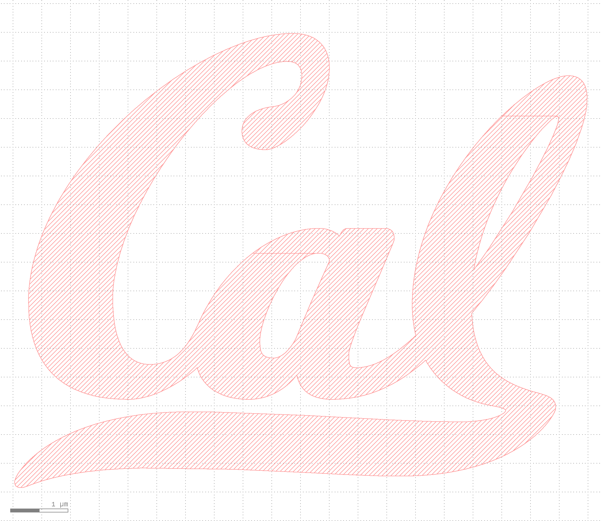
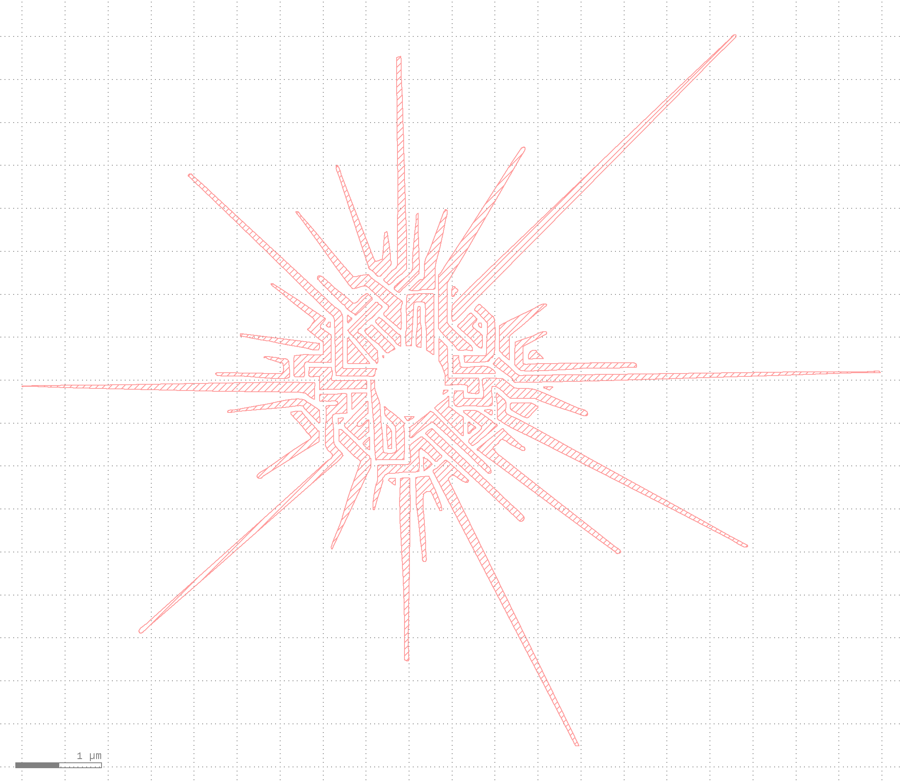
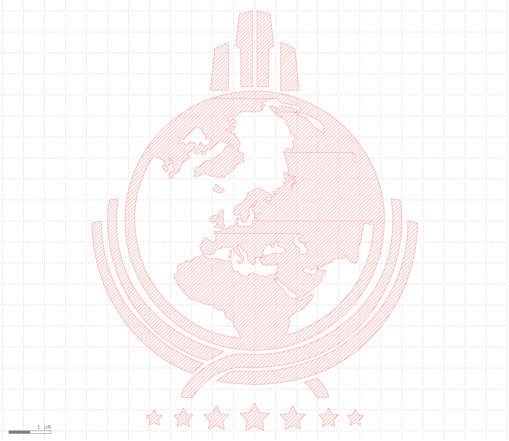

# Fun Symbols GDS Library
Fun logos & symbols

### Style Guidelines
- Each symbol shall have its own cell, and a descriptive `UPPER_SNAKE_CASE` name
- Each symbol shall be placed entirely in layer `0/0`
- Each symbol shall be centered at the origin `(0, 0)`
- Each symbol shall have an overall maximum size of $10 \pm 1 \text{ um}$
- Include a screenshot and link to image source (if applicable) in the `Current Symbols` section

### Current Symbols

#### CAL_LOGO
[University of California, Berkeley](https://www.berkeley.edu/)

#### EYE_OF_THE_UNIVERSE
[Outer Wilds](https://www.mobiusdigitalgames.com/outer-wilds.html)

#### KSP_LOGO
[Kerbal Space Program](https://www.kerbalspaceprogram.com/)

#### SUPER_EARTH
[Helldivers 2](https://www.arrowheadgamestudios.com/)

